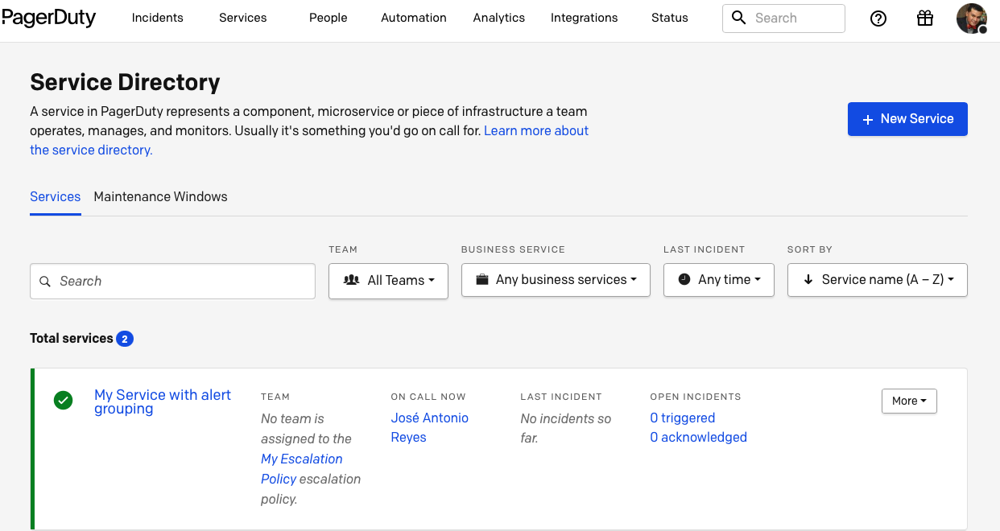
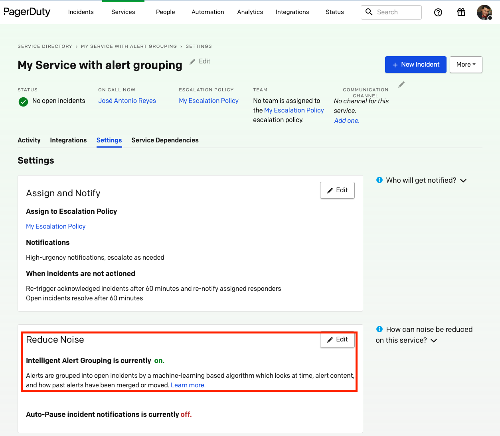
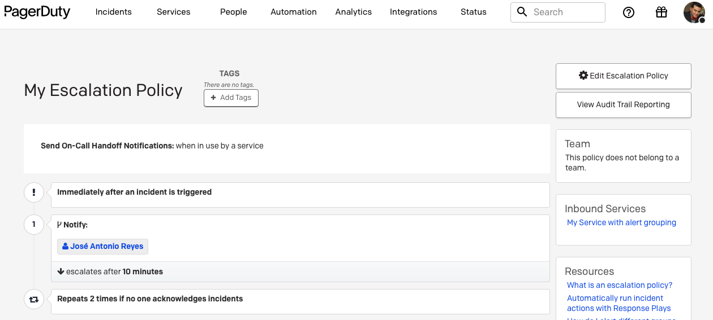

# PagerDuty Go API Test Integration

This is a simple integration of [PagerDuty Go API](https://github.com/heimweh/go-pagerduty) for creating a Service and then updating it to have alerts grouping with the *Intelligent* noise reduction mode.

Since is an integration just for testing it isn't very open to external parameters appart from the PagerDuty API Key and the User's email which will be notified of the alerts and incidents.

> The first time the program runs will create a Service with intelligent alert grouping and an Escalation Policy, but subsequents runs will only reuse the already created resources and return success after repeating the config for alert grouping.

## Parameters accepted by Enviroments Variables

* `PAGERDUTY_TOKEN`: PagerDuty REST API Key [docs](https://support.pagerduty.com/docs/api-access-keys#generate-a-general-access-rest-api-key).
* `PD_USER_EMAIL`: Email of PagerDuty registered user whom created REST API Key.

## Comands

```sh
# RUN
PAGERDUTY_TOKEN=u+iXibZntHXxshRjoVdU PD_USER_EMAIL=youremail@here.com go run ./...

# TEST
go test .

# INSTALL
PAGERDUTY_TOKEN=u+iXibZntHXxshRjoVdU PD_USER_EMAIL=youremail@here.com go install ./...
# build binary pdsvcalertgrouping
```

## Screen Captures





